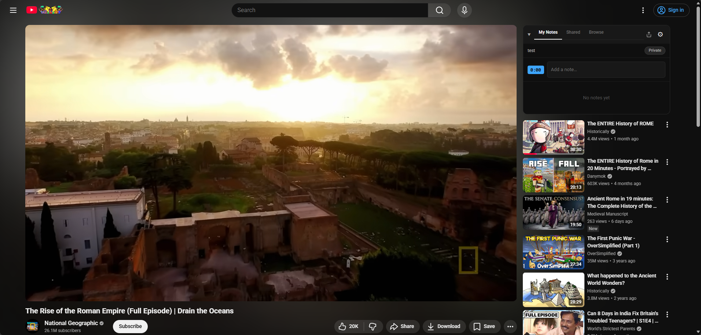
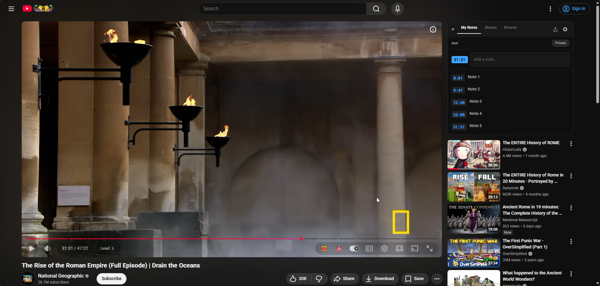
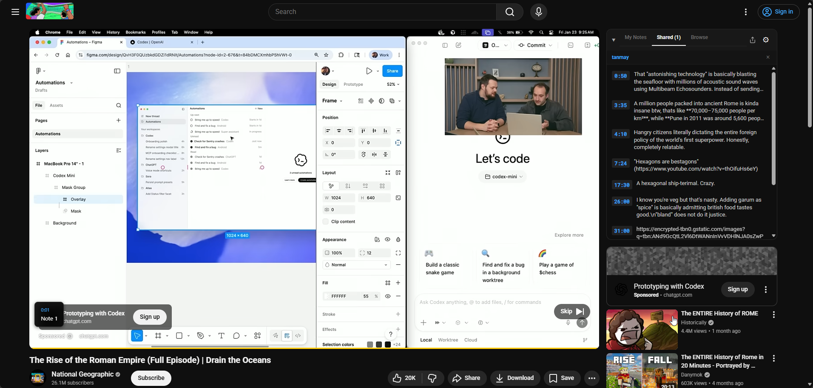
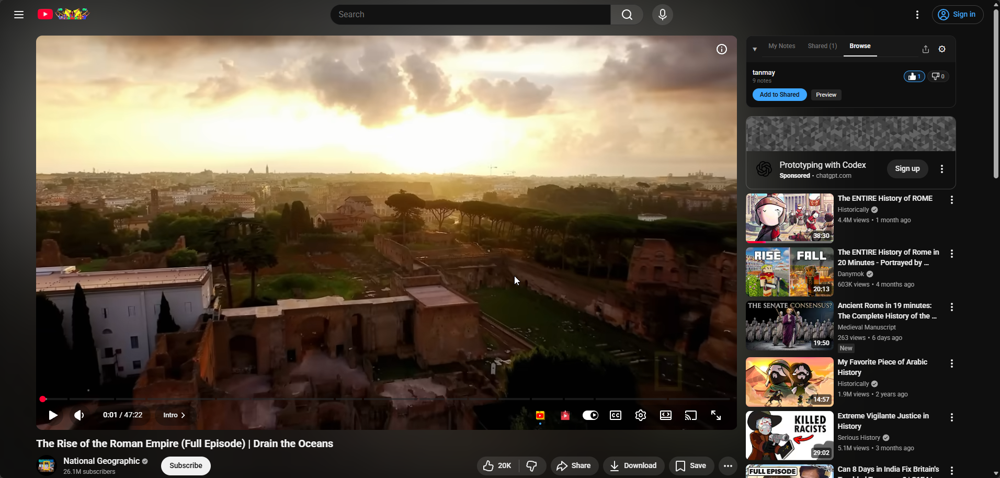
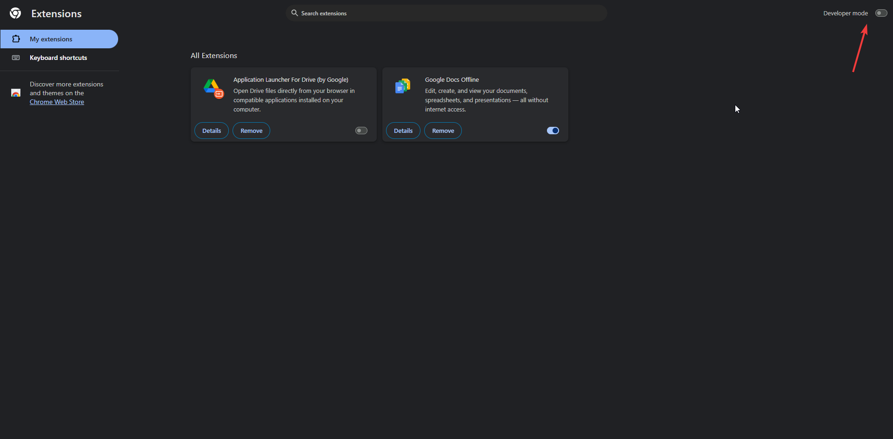
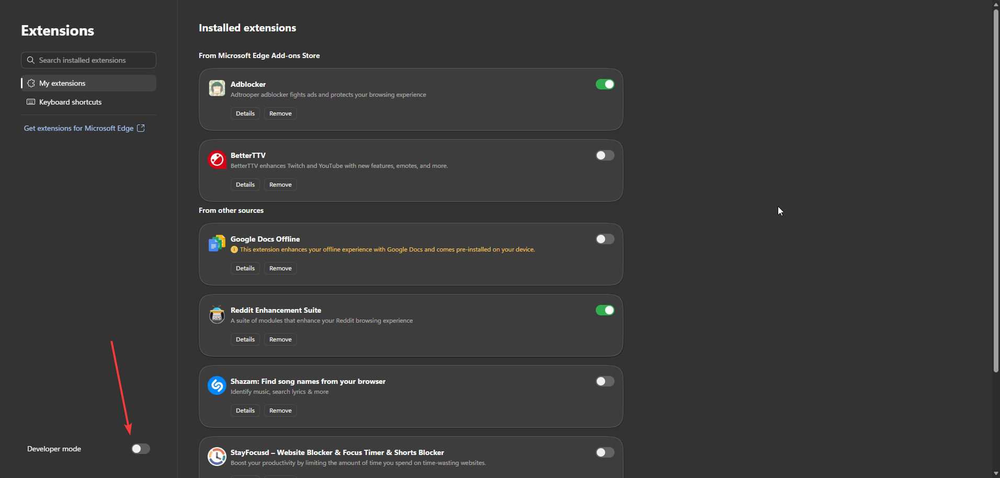
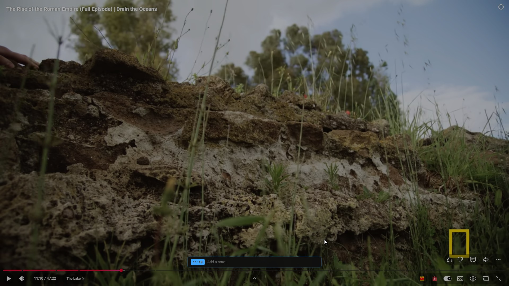
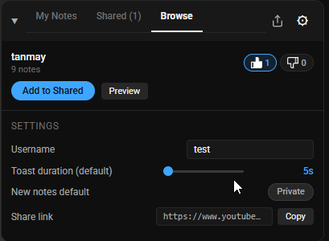

# LayerNote

LayerNote is a high-performance Chrome extension (Manifest V3) that adds timestamped annotation layers to YouTube videos. Notes sync to live playback and appear as floating toasts at the exact moment they matter. You can write your own notes, share them via a link, or browse what other people have annotated on the same video.



---

## Table of Contents

1. [Key Features](#key-features)
2. [Installation & Setup Guide](#installation--setup-guide)
3. [Tech Stack](#tech-stack)
4. [Project Architecture](#project-architecture)
5. [How It Works Under the Hood](#how-it-works-under-the-hood)
6. [System Constants & Safety Boundaries](#system-constants--safety-boundaries)
7. [Distribution Packaging](#distribution-packaging)

---

## Key Features

- **Real-time high-precision playback sync** — the sync engine tracks video execution in real time, firing toasts within fractions of a second of the target timestamp.
- **In-context layout injection** — a responsive panel anchors itself into YouTube's sidebar; fullscreen adds a floating input overlay directly on the video player.
- **Three-tab layer composition:**
  - **My Notes** — your own editable layer with a public/private toggle and search.
  - **Shared** — read-only segments for every friend or public layer you've added; all annotations from all shared layers show as live toasts.
  - **Browse** — discover what other people have annotated on the same video, sorted by 👍/👎 score.
- **Community reactions** — like or dislike any public note collection; reactions are mutually exclusive and toggleable.
- **Public sharing** — flip a toggle to publish your layer so anyone can find it in Browse.
- **Cloud sync** — local edits commit asynchronously to Supabase; retries run on a 5-minute alarm if a request fails.
- **Storage migration pipeline** — versioned local schema upgrades run on extension update without losing user data.
- **Full keyboard isolation** — typing in any text input never triggers YouTube's shortcuts (j, k, l, c, etc.).





---

## Installation & Setup Guide

### 1. Download the latest release

Grab the pre-built `layernote.zip` from the [Releases page](https://github.com/tanmayvdani/layernote/releases). The zip extracts to a single `layernote/` folder — pick somewhere you'll remember (e.g. `Downloads/layernote`).

### 2. Open your browser's extension page

- Chrome: [chrome://extensions/](chrome://extensions/)
- Edge: [edge://extensions/](edge://extensions/)

### 3. Turn on Developer mode

The toggle is in the top right corner of the extensions page. Flip it on.




### 4. Load the extension

1. Click **Load unpacked** (top left after the toggle is on)
2. In the file picker, select the `layernote` folder you extracted
3. Open any YouTube video — LayerNote appears in the sidebar

> **Tip:** if you see "Manifest version not supported" or similar, make sure you picked the `layernote` folder itself (the one that contains `manifest.json`), not its parent.

---

## Tech Stack

- **Extension platform:** Chrome Extensions Manifest V3 (MV3)
- **Language:** TypeScript (strict mode)
- **State management:** Zustand (vanilla, framework-independent)
- **Persistence:** Supabase client + `chrome.storage.local`
- **Bundler:** esbuild

---

## Project Architecture

```
LayerNote/
├── icons/                 icon assets for the manifest and toolbar
├── src/
│   ├── background/        service worker — sync, retries, alarms
│   │   └── index.ts
│   ├── content/           injected into YouTube pages
│   │   ├── constants.ts   validation limits, selectors, defaults
│   │   ├── layer-state.ts zustand store
│   │   ├── timestamp-engine.ts  animation-frame sync, toast rendering
│   │   ├── youtube.ts     entry point — page routing & init
│   │   └── ui/            vanilla TS components
│   │       ├── annotation-form.ts
│   │       ├── annotation-list.ts
│   │       ├── player-overlay.ts   fullscreen input popup
│   │       ├── sidebar.ts
│   │       └── styles.ts
│   └── storage/           local cache + Supabase client
│       ├── local.ts
│       ├── supabase.ts
│       └── types.ts
├── build.mjs              esbuild production config
├── manifest.json          MV3 manifest
└── package.json
```

---

## How It Works Under the Hood

### High-precision sync loop

The `HighPrecisionSyncEngine` runs a `requestAnimationFrame` loop that watches the current playback time, looks up annotations in a bucket-indexed map, and fires any toast within `±0.4s` of its target. A `Set` of shown annotation IDs prevents the same note from firing twice in a single playback. To keep performance stable under high-density notification streams, the overlay caps simultaneous toasts at 3.

### Background sync & retry queue

The service worker runs separately from the UI. Local mutations set a layer's `syncState` to `'queued'` and post a `TRIGGER_SYNC` message. The worker batches layers and `upsert`s them to Supabase. If a request fails, a `sync_retry_alarm` (every 5 minutes) retries the queue.

### Storage layout

Local data is keyed under `chrome.storage.local` for fast keyed access:

- `ownerToken` — anonymous UUID that identifies the user without login
- `video:<videoId>` — index linking a video to its primary layer
- `layer:<layerId>` — layer metadata
- `annotation:<layerId>:<annotationId>` — individual notes
- `sharedLayerIds` — list of layers the user has added from shared links or Browse

Migrations transform older schemas forward on extension update without losing data:
v1 (legacy array storage) → v2 (per-id keys) → v3 (owner name, toast duration) → v4 (public flag, reaction counts).

### Player overlay (fullscreen)

Because the sidebar is hidden in fullscreen, clicking the **+** button on the player pops up a floating input directly over the video. A semi-transparent backdrop and a frosted-glass bar with the timestamp badge + text input. Enter submits, Escape or backdrop click dismisses. The input stops propagation on `keydown`/`keyup`/`keypress` so YouTube shortcuts never fire while typing.



---

## System Constants & Safety Boundaries

Defined in `src/content/constants.ts`:

| Constant | Value | Purpose |
| --- | --- | --- |
| `MAX_ANNOTATIONS_PER_LAYER` | 5,000 | Prevents sync engine memory blowups |
| `MAX_TITLE_LENGTH` | 100 | Keeps layer titles compact |
| `MAX_CONTENT_LENGTH` | 200 | Ensures toasts stay legible |
| `MAX_USERNAME_LENGTH` | 50 | Caps display name length |
| `TOAST_DURATION_MIN` / `MAX` | 5s / 30s | Bounds how long toasts stay visible |
| `TIMESTAMP_DELTA_SECONDS` | 0.4 | Max sync variance for the rendering loop |
| `MAX_IMPORT_SIZE_BYTES` | 2 MB | Rejects oversized layer imports |
| `MAX_VISIBLE_TOASTS` | 3 | Caps simultaneous toast count |



---

## Distribution Packaging

For contributors and release managers:

```bash
npm install
npm run build
cd release
npx bestzip ../layernote.zip layernote
```

`npm run build` produces a `release/layernote/` folder that contains the full extension (manifest, JS bundles, icons). The zip command runs from inside `release/` and packages `layernote/` as a single entry, so unzipping yields one `layernote/` directory that users can load directly via **Load unpacked**.

---

## License

MIT
