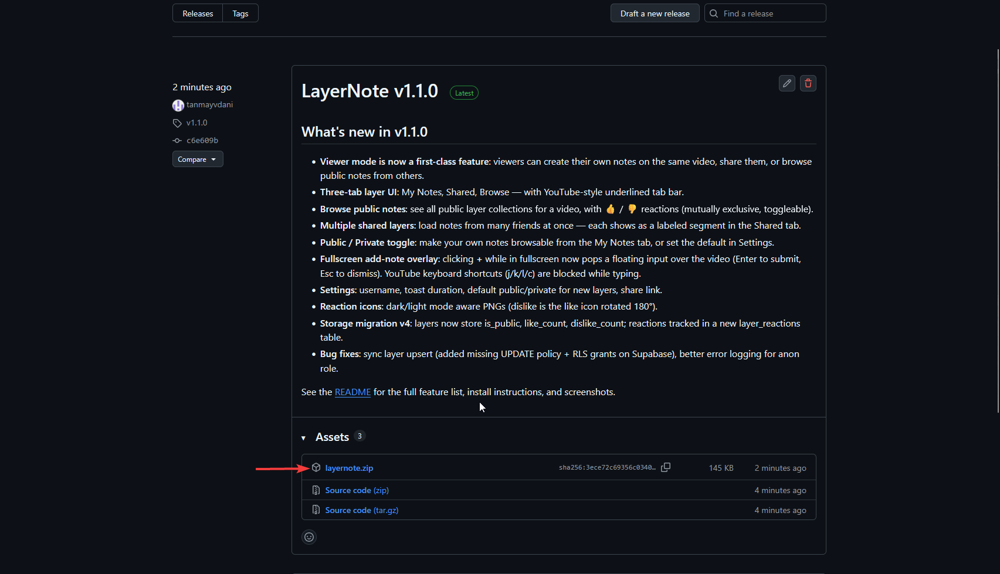
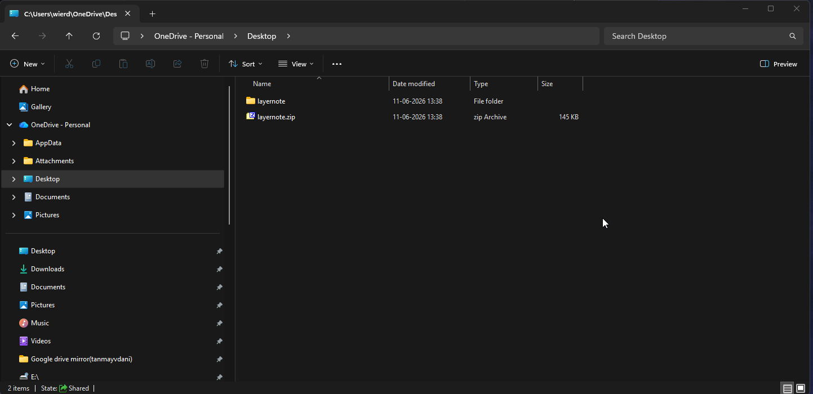
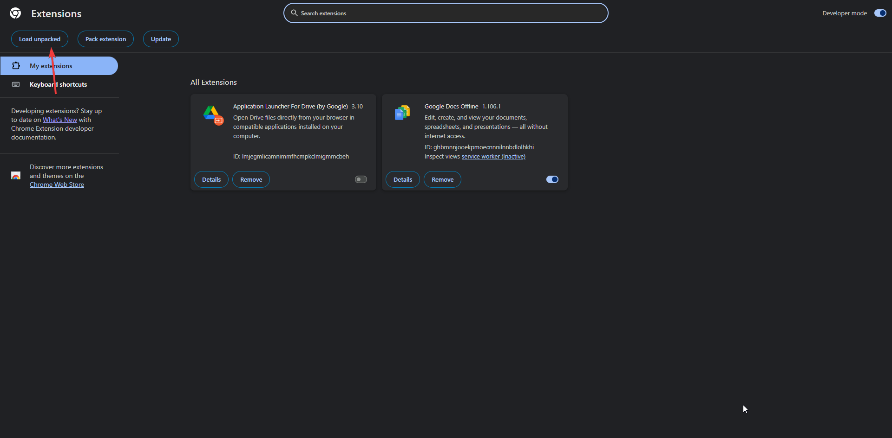
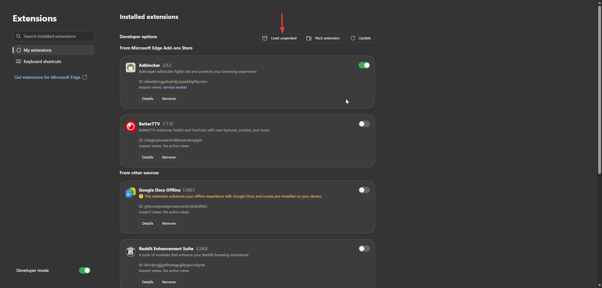
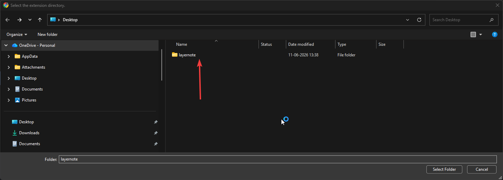
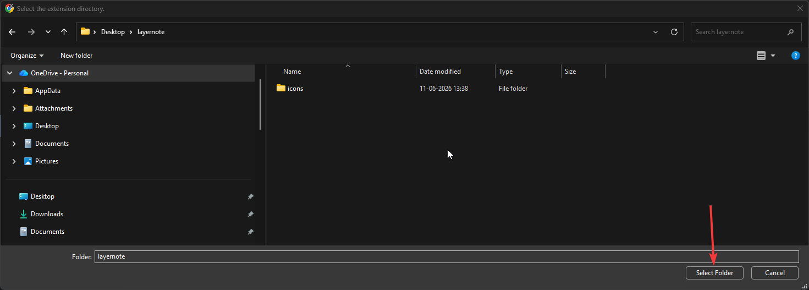

# LayerNote

**Add timestamped notes to any YouTube video.** Your notes pop up as toasts at the exact moment they matter. Keep them private, share them with a link, or browse what other people have already annotated on the same video.


---

## Install in 5 minutes (no terminal, no account)

LayerNote isn't on the Chrome Web Store yet, so you load it manually. It takes about a minute once you've done it.

> Works on **Google Chrome** and **Microsoft Edge**. Other Chromium browsers (Brave, Opera, Arc) work the same way.

### Step 1 — Download the zip

Go to the [**Releases page**](https://github.com/tanmayvdani/layernote/releases) and download **`layernote.zip`** from the latest release.



### Step 2 — Unzip it

Right-click the zip and choose **Extract All...** (or use 7-Zip / your tool of choice). You'll get a folder called **`layernote`** next to the zip. **Keep this folder somewhere permanent** — your Desktop, Documents, anywhere you won't delete by accident. The extension loads from this folder every time you open the browser.



### Step 3 — Open your browser's extensions page

Copy-paste one of these into your address bar and press Enter:

| Browser | URL |
| --- | --- |
| Chrome | `chrome://extensions` |
| Edge | `edge://extensions` |
| Brave | `brave://extensions` |

### Step 4 — Turn on Developer mode

This is a toggle on the extensions page. You only have to do it once.

- **Chrome / Brave / Opera / Arc:** top-right corner
- **Edge:** bottom-left corner

<table>
<tr>
<td align="center"><b>Chrome</b></td>
<td align="center"><b>Edge</b></td>
</tr>
<tr>
<td></td>
<td></td>
</tr>
</table>

### Step 5 — Click "Load unpacked"

Once Developer mode is on, a new **Load unpacked** button appears at the top of the page. (Brave, Opera, and Arc follow Chrome's layout here too.)

<table>
<tr>
<td align="center"><b>Chrome</b></td>
<td align="center"><b>Edge</b></td>
</tr>
<tr>
<td></td>
<td></td>
</tr>
</table>

### Step 6 — Pick the `layernote` folder

A file picker opens. Navigate to wherever you unzipped it and **open the `layernote` folder** (you should see `icons` inside it — that means you're in the right place). Then click **Select Folder**.




> If you see **"Manifest file is missing or unreadable"**, you're one level too high. Go *into* the `layernote` folder so the picker shows `icons/` inside, then click Select Folder.

### Step 7 — Open a YouTube video

That's it. Open any YouTube video and LayerNote will be sitting in the sidebar, ready to go.

---

## What you can do with it

### Write your own notes
Pick any moment, type a note, and it'll appear as a toast every time the video reaches that timestamp.


### Share or follow a friend's notes
Flip the public toggle on any layer and share the link. The Shared tab shows live toasts from every layer you've followed.


### Browse what others have annotated
The Browse tab shows every public layer that exists for the video you're watching, sorted by 👍/👎.


### Add notes in fullscreen too
A floating input pops up over the player. Enter to save, Esc to dismiss. YouTube's shortcuts (j, k, l, c) won't fire while you're typing.


### Tune it to your taste
Set your display name, change how long toasts stay on screen, and pick whether new layers default to public or private.


---

## Feature list

- **Real-time playback sync** — notes fire within a fraction of a second of their timestamp.
- **In-context sidebar** — fits cleanly into YouTube's existing layout, no popup window required.
- **Three tabs:** My Notes (yours), Shared (friends' layers), Browse (public discovery).
- **Public / private toggle** per layer — flip it any time.
- **Community reactions** — 👍 / 👎 on public layers, mutually exclusive and toggleable.
- **Multiple shared layers at once** — load notes from many friends, each shows as a labelled segment.
- **Cloud sync** with retry queue — local edits commit asynchronously to Supabase; failed requests retry on a 5-minute alarm.
- **Versioned local storage migrations** — extension updates never lose your notes.
- **Full keyboard isolation** — typing in any LayerNote input never triggers YouTube's shortcuts.
- **No account required** — an anonymous owner token is generated on first use.

---

## Updating to a new version

1. Download the new `layernote.zip` from Releases.
2. Replace your existing `layernote` folder with the newly extracted one (same location is easiest).
3. Open `chrome://extensions` or `edge://extensions` and click the **reload** (↻) icon on the LayerNote card.

Your notes are stored locally + on Supabase, so they survive updates automatically.

---

## For developers

### Tech stack

- **Platform:** Chrome Extensions Manifest V3
- **Language:** TypeScript (strict)
- **State:** Zustand (vanilla, no framework)
- **Persistence:** `chrome.storage.local` + Supabase
- **Bundler:** esbuild

### Project layout

```
LayerNote/
├── icons/                       icon assets for the manifest and toolbar
├── src/
│   ├── background/              service worker — sync, retries, alarms
│   │   └── index.ts
│   ├── content/                 injected into YouTube pages
│   │   ├── constants.ts         validation limits, selectors, defaults
│   │   ├── utils.ts             shared helpers (timestamp formatting, clipboard, map building)
│   │   ├── layer-state.ts       zustand store
│   │   ├── timestamp-engine.ts  rAF sync loop, toast rendering
│   │   ├── youtube.ts           entry point — page routing & init
│   │   └── ui/                  vanilla TS components
│   │       ├── annotation-form.ts
│   │       ├── annotation-list.ts
│   │       ├── player-overlay.ts    fullscreen input popup
│   │       ├── sidebar.ts
│   │       └── styles.ts
│   └── storage/                 local cache + Supabase client
│       ├── local.ts
│       ├── supabase.ts
│       └── types.ts
├── build.mjs                    esbuild production config
├── manifest.json                MV3 manifest
└── package.json
```

### How it works under the hood

**High-precision sync loop.** `HighPrecisionSyncEngine` runs a `requestAnimationFrame` loop that watches `video.currentTime`, looks up annotations in a bucket-indexed map, and fires any toast within `±0.4s` of its target. A `Set` of shown annotation IDs prevents the same note from firing twice in one playback. The overlay caps simultaneous toasts at 3.

**Background sync & retry queue.** The service worker runs separately from the UI. Local mutations flip a layer's `syncState` to `'queued'` and post a `TRIGGER_SYNC` message. The worker batches layers and `upsert`s them to Supabase. Failed requests retry on a `sync_retry_alarm` every 5 minutes.

**Storage layout.** Local data is keyed under `chrome.storage.local` for fast keyed access:

- `ownerToken` — anonymous UUID that identifies the user without login
- `video:<videoId>` — index linking a video to its primary layer
- `layer:<layerId>` — layer metadata
- `annotation:<layerId>:<annotationId>` — individual notes
- `sharedLayerIds` — list of layers added from links or Browse

Migrations transform older schemas forward on extension update without losing data:
`v1` (legacy array storage) → `v2` (per-id keys) → `v3` (owner name, toast duration) → `v4` (public flag, reaction counts).

**Player overlay (fullscreen).** Because the sidebar is hidden in fullscreen, the **+** button on the player pops up a frosted-glass input floating over the video. The input stops propagation on `keydown`/`keyup`/`keypress` so YouTube shortcuts never fire while typing. Enter submits, Escape or backdrop click dismisses.

### System constants

Defined in `src/content/constants.ts`:

| Constant | Value | Purpose |
| --- | --- | --- |
| `MAX_ANNOTATIONS_PER_LAYER` | 5,000 | Prevents sync engine memory blowups |
| `MAX_TITLE_LENGTH` | 100 | Keeps layer titles compact |
| `MAX_CONTENT_LENGTH` | 200 | Ensures toasts stay legible |
| `MAX_USERNAME_LENGTH` | 50 | Caps display name length |
| `TOAST_DURATION_MIN` / `MAX` | 5s / 30s | Bounds how long toasts stay visible |
| `TIMESTAMP_DELTA_SECONDS` | 0.4 | Max sync variance for the rendering loop |
| `MAX_IMPORT_SIZE_BYTES` | 2 MB | Rejects oversized layer imports |
| `MAX_VISIBLE_TOASTS` | 3 | Caps simultaneous toast count |

### Build from source

```bash
npm install
npm run build
```

`npm run build` produces a `release/layernote/` folder that contains the full extension (manifest, JS bundles, icons). You can load that folder directly via **Load unpacked** in the same way as the released zip — useful for local development.

### Cutting a release

```bash
npm run build
cd release
npx bestzip ../layernote.zip layernote
```

The zip command runs from inside `release/` and packages `layernote/` as a single entry, so unzipping yields one `layernote/` directory that users can load directly.

---

## License

MIT
